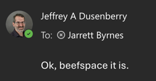

# Computing Resources for the Lab

## Lab Dropbox

Upon joining the lab, contact Jarrett to get a [Dropbox](https://www.dropbox.com) account. You have unlimited storage there. Use it as you need, and share with collaborators as needed. All lab projects should have a top-level drive in the `CELP Lab shared folder`. We use dropbox as a lab because it is secure, robust, and when you leave the lab and your university account is terminated, your files will not disappear.

You should set up the [Dropbox Desktop App](https://www.dropbox.com/install) on your computer so that your dropbox and the lab dropbox will be mounted just as another drive/folder on your computer. This is also setup on all lab computers with a lab login (where you can use the lab shared folder).

## Google Drive: Useful but beware

The university gives us Google Drive accounts with unlimited storage. These are useful, but, beware. When you leave the university, and your account is terminated, all files you have created will disappear. Whenever possibl.e

You should set up the [Google Drive Desktop App](https://support.google.com/a/users/answer/13022292?hl=en) on your computer so that you can use Google Drive just as another drive/folder on your computer and not have to deal with its web interface.

## File Storage and Archiving via Beefspace

  
  
  
All lab long-term archiving of large files - images, videos, rasters, etc. should take place using the lab file server, beefspace. beefspace can only be access via a wired connection on campus or on a VPN connection. This means if you are on campus and are on the campus wireless network, you will still need to login to the campus VPN.

Instructions for setting up your computer to connect to the campus VPN can be found [here](https://umassboston.service-now.com/sp?id=kb_article_view&sysparm_article=KB0010685&sys_kb_id=bde423a21be0e51078b5a6ca234bcbcc&spa=1).

There is a lab account for the computers in the lab. For grad students or techs who need more access (e.g., off campus), contact Jarrett for a username and password or the lab login.

Once you have an account and are on the proper network, you can connect to beefspace via its samba server to mount a drive on your computer. You will have to login with your username and password.

There are two main top-level directories that you will see on beefspace. The first is Working. If you are uploading new files, this is the place. The second is Archive. Once a project's files are uploaded and QA/QC-ed, they will be moved to a parallel directory in Archive. Only Jarrett and relevant project managers have write access to archive in order to ensure files cannot be accidentally deleted.

Each main directory follows the same structure. At the top-level, there should be a folder for a whole project (e.g., `Stone Living Lab Living Seawalls`). There is a top-level `Readme.md` file. In this file, using [markdown](https://commonmark.org/help/) describe what is the general contents of each top-level project folder. 

Within a project folder, organize as needed. There should also be a `Readme.md` written in markdown that describes what is in each subfolder. Each sub-folder should follow a logical order with a descriptive name and have it's own `Readme.md` that describes what is inside of it. This is not done to be annoying, but rather to make sure there is a record of what is there. This information will be moved to archive as well, and we want to make sure we have full documentation of what files and directories are, any naming conventions, and as much descriptive metadata as possible. 

So, this will end up looking something like

<pre><code style="white-space: pre-wrap !important; ">
```
Archived
 |
 | - Readme.md - this will have information about what is in ALL subdirectories. Detailed
 |
 |- Project 1 (e.g., Living Seawalls)
    |
    | - Readme.md - a list of what all survey or other subfolders are and what infromation is in them
    |
    |- Survey 1 (e.g., 20260615_Condor_East_Videos)
    |
    |- Readme.md - A manifest of the files and what is in each one. This could also point to a CSV table with that info.
    |
    |-Video 1
    |-Video 2
    | etc....
```
</code></pre>

Remember, each piece of information is a note to two sets of people. Well, three. The first is Jarrett in the future so that he can make sense of things long after you are gone. The second is the poor students and techs who have to make sense of things long after you are gone. Pity them. The final, and most important, is future you. You might want this information! Maybe you need it in manuscript revisions. Maybe you need it because of a committee member note. Maybe it's 20 years from now and you remember, oh wait, I have an image or video from somewhere that will unlock something I never even thought of at that time. 

In this lab, we try and abide by the [old addage](https://ascii.textfiles.com/archives/3181) "Metadata is a love note to your future self." Make it [useful](https://theanarchivist.medium.com/metadata-is-a-love-note-to-the-future-138bd5fc0e76).

## Remote Access to R and Publishing Shiny Apps
If you would like a remote R server, you will need an account on [Theia](https://theia.umb.edu/) which runs a remote instance RStudio. You can also put up shiny apps and more if you create a directory `~/ShinyApps` and make a folder for each project. These can be viewed using your username using a standard format -  `https://theia.umb.edu/shiny/u/user.name/` - such as [https://theia.umb.edu/shiny/u/jarrett.byrnes/](https://theia.umb.edu/shiny/u/jarrett.byrnes/).

To get access, contact [research.computing@umb.edu](mailto: research.computing@umb.edu).


## High Performance Computing

We have access to many HPC resources as part of UMB. Our [research computing](https://www.umb.edu/rc/) staff is amazing and incredibly helpful. Below are some options for HPC.

### Chimera, Gibbs, and Other On Campus Options

On campus, we have two clusters. [Chimera](https://www.umb.edu/rc/hpc/chimera/) serves most needs for HPC and has access via ssh and other options. [Gibbs](https://www.umb.edu/rc/hpc/gibbs/) is an older GPU-based cluster. For both, see the [documentation](https://rcdocs.umb.edu) about use by our research computing staff. 

To get access, contact [research.computing@umb.edu](mailto: research.computing@umb.edu) who will set you up, and also put you on a list for training classes.


### Unity 

For more intensive High Performance Computing, the UMass System provides a larger HPC platform, [Unity](https://docs.unity.rc.umass.edu). You can [request access](https://nam10.safelinks.protection.outlook.com/?url=https%3A%2F%2Funity.rc.umass.edu%2Fpanel%2Faccount.php&data=05%7C01%7CTheresa.Nelson%40umb.edu%7C373d585f82984971290908dba4b2c8a1%7Cb97188711ee94425953c1ace1373eb38%7C0%7C0%7C638284860006281503%7CUnknown%7CTWFpbGZsb3d8eyJWIjoiMC4wLjAwMDAiLCJQIjoiV2luMzIiLCJBTiI6Ik1haWwiLCJXVCI6Mn0%3D%7C3000%7C%7C%7C&sdata=bKRplGeecFwdXB5N9F9J87aV2Sx8OHcobSL9eMx9g3I%3D&reserved=0) and once you have an account, opt to join the pi group headed by `jarrett_byrnes_umb_edu`.

We also highly recommend you join the unity slack channel. For further questions on access and setup, contact [research.computing@umb.edu](mailto: research.computing@umb.edu) who will point you in the right direction.